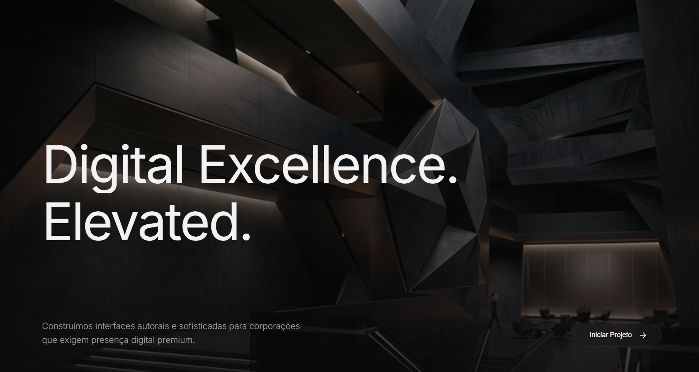

# Executive Digital Landing Page



Landing page corporativa de alto nível desenvolvida com foco em sofisticação visual e motion design avançado. O projeto utiliza uma arquitetura baseada em **React** e **Vite**, combinando animações performáticas via Framer Motion e rolagem fluida via Lenis.

## 🚀 Tecnologias e Stack

A stack foi escolhida priorizando controle granular de design e performance:
- **Framework:** [React 19](https://react.dev/) + [Vite](https://vitejs.dev/)
- **Motion Design:** [Framer Motion](https://www.framer.com/motion/) (Revelações ao scroll e animação tipográfica em cascata)
- **Smooth Scroll:** [Lenis](https://lenis.studiofreight.com/) (Gerenciamento nativo de inércia e rolagem de página)
- **Estilização:** CSS Vanilla (`index.css`) com variáveis semânticas para controle total da direção de arte "Dark Mode Premium".
- **Ícones:** [Lucide React](https://lucide.dev/)

## 📦 Como Rodar o Projeto

### Pré-requisitos
- [Node.js](https://nodejs.org/) (versão 18+ recomendada)
- `npm` ou `yarn`

### Instalação e Execução

1. Clone o repositório ou acesse o diretório principal:
```bash
cd "landingpage executivo"
```

2. Instale as dependências reais do projeto:
```bash
npm install
```

3. Inicie o servidor de desenvolvimento:
```bash
npm run dev
```

## 🏗️ Estrutura do Projeto e Arquitetura Visual

O projeto foge de templates genéricos e adota componentes dedicados para cada seção da narrativa visual.

```
src/
├── components/
│   ├── SmoothScroll.jsx     # Wrapper raiz que injeta a física de scroll Lenis e trata o Scroll Restoration
│   ├── Hero.jsx             # Primeira dobra. Contém efeito parallax de imagem e máscara de gradiente
│   ├── AboutStatement.jsx   # Manifesto em tipografia massiva com animação "whileInView" (stagger palavra por palavra)
│   ├── Metrics.jsx          # Componente focado na prova social através de números animados
│   ├── Methodology.jsx      # Seção com comportamento sticky para o título e scroll horizontal/vertical para os cards
│   ├── Expertise.jsx        # Lista de serviços com microinterações refinadas nos ícones e descriptions
│   └── Footer.jsx           # Rodapé oversized com CTA e navegação secundária
├── App.jsx                  # Orquestrador central que envelopa os componentes no SmoothScroll
└── index.css                # Única fonte de verdade para Design Tokens (cores chumbo/off-white) e tipografia
```

## 🛠️ Decisões Técnicas (ADRs Implícitos)

1. **Por que CSS Vanilla e não TailwindCSS?**
   - Para este nível de exigência visual (Frontend Criativo), classes utilitárias podem poluir a leitura do markup. O uso de CSS Vanilla com variáveis (`--bg-primary`, `--spacing-2xl`) garante controle total sobre microinterações e manutenção de um design system autoral sem depender de configurações externas de frameworks CSS.

2. **Framer Motion `whileInView` vs `useScroll`:**
   - Para contornar dessincronizações de cálculo (Invariant Violations do Framer Motion) ao animar blocos complexos de texto dentro do contêiner modificado pelo Lenis, a técnica escolhida no componente `AboutStatement` foi utilizar `staggerChildren` com `whileInView`. Isso assegura uma entrega visual de altíssima fidelidade que não crasha ao navegar ou redimensionar a página.

3. **Scroll Restoration Manual:**
   - Integrado diretamente no wrapper `SmoothScroll`, forçamos o `window.scrollTo(0,0)` para que experiências imersivas não iniciem "quebradas" do meio da tela quando os usuários recarregam a página via *F5*.

## 🔧 Scripts Disponíveis

No arquivo `package.json`, você pode rodar os seguintes comandos:

- `npm run dev`: Inicia o servidor Vite para desenvolvimento local com Hot Module Replacement.
- `npm run build`: Cria uma build de produção super otimizada na pasta `dist`.
- `npm run preview`: Permite visualizar a build de produção rodando localmente antes de um deploy.
- `npm run lint`: Valida o código utilizando regras do ESLint para React.
